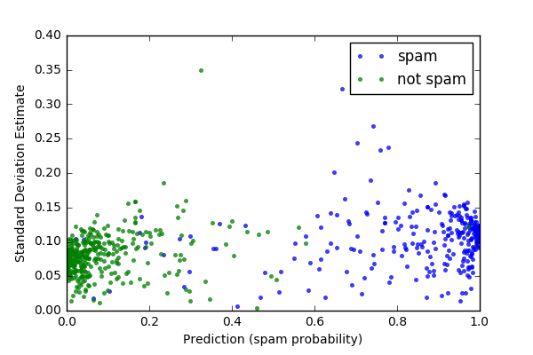

# Summary
Random forests are a method for predicting numerous ensemble learning tasks. The variability in predictions is important for measuring standard errors and estimating standard errors. Forest-Confidence-Interval is a Python module for calculating variance and adding confidence intervals to scikit-learn random forest regression or classification objects. The core functions calculate an in-bag and error bars for random forest objects. This module is an implementation of an algorithm developed by @wager_confidence_2014 and previously implemented in R here [@wager_randomforestci_2016].

# Statement of need

The authors should clearly state what problems the software is designed to solve and who the target audience is

Example usage

The authors should include examples of how to use the software (ideally to solve real-world analysis problems).

# Examples gallery
## Regression example
-

## Classification example
-

# References
