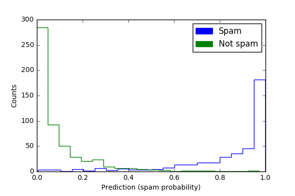

# Summary
Random forests are a method for predicting numerous ensemble learning tasks. Prediction variability can illustrate how influential the training set is for producing the observed random forest predictions and provides additional information about prediction accuracy. `forest-confidence-interval` is a Python module for calculating variance and adding confidence intervals to `scikit-learn` random forest regression or classification objects. The core functions calculate an in-bag and error bars for random forest objects. Our software is designed for individuals using `scikit-learn` random forest objects that want to add estimates of uncertainty to random forest predictors. This module is an implementation of an algorithm developed by @wager_confidence_2014 and previously implemented in R [@wager_randomforestci_2016].

# Usage
Our package's `random_forest_error` and `calc_inbag` functions use the random forest object (including training and test data) to create variance estimates that can be plotted (e.g. as confidence intervals or standard deviations). The in-bag matrix that fit the data is set to `None` by default, and the in-bag will be inferred from the forest. However, this only works for trees for which bootstrapping was set to `True`. That is, if sampling was done with replacement. Otherwise, users need to provide their own in-bag matrix.

# Examples gallery
The regression example uses a slightly modified data-set from the Carnegie Mellon University's StatLib library (available from the [UC Irvine Machine Learning Repository](https://archive.ics.uci.edu/ml/datasets/Auto+MPG)) with features of different cars and their MPG [@quinlan_combining_1993]. The classification example generates synthetic data to simulate a task like that of a spam filter: classifying items into one of two categories (e.g., spam/non-spam) based on a number of features. This module will work for matrices or `pandas` data frames. Then, `scikit-learn` functions split the example data into training and test data and generate a random forest object (regression or classifier). The examples calculate variance from random forest objects that use the highest mean probability estimate across the trees. The focus on means for estimates and unit comparability between sample mean and dispersion measures is the basis for plotting with the square root of the variance (standard deviation). As the plots with variance estimated show, some predictions have more error than others. For instance, in the regression (MPG) example, predictions of higher mileage MPG are associated with greater variance than lower mileage predictions.

## Regression example

### No variance estimated
-

### Plot with variance
-

## Classification example
### No variance estimated
-

### Plot with variance
-

## Community guidelines

Contributions are very welcome, but we ask that contributors abide by the [contributor covenant](http://contributor-covenant.org/version/1/4/).

To report issues with the software, please post to the
[issue log](https://github.com/scikit-learn-contrib/forest-confidence-interval/issues)
Bug reports are also appreciated, please add them to the issue log after
verifying that the issue does not already exist.
Comments on existing issues are also welcome.

Please submit improvements as pull requests against the repo after verifying
that the existing tests pass and any new code is well covered by unit tests.
Please write code that complies with the Python style guide,
[PEP8](https://www.python.org/dev/peps/pep-0008/)

Please e-mail [Ariel Rokem](mailto:arokem@gmail.com), [Kivan Polimis](mailto:kivan.polimis@gmail.com), or [Bryna Hazelton](mailto:brynah@phys.washington.edu ) if you have any questions, suggestions or feedback.

# References
